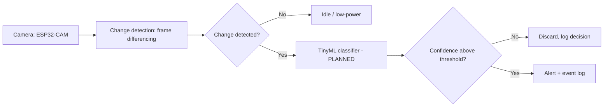

# Event-Triggered Edge AI for Low-Power Wildlife & Intrusion Monitoring

**Program:** 1M1B AI for Sustainability Virtual Internship (with IBM SkillsBuild & AICTE)

**SDG alignment:** SDG 15 (Life on Land) primary; SDG 13 (Climate Action) and SDG 7 (Affordable and Clean Energy) secondary

## Problem statement

*How might we use AI to detect wildlife and human intrusion in remote farm and forest edges so that conservation and crop protection can become more sustainable?*

- Continuous recording drains batteries.
- Useless footage overwhelms the people who must review it.
- Remote areas often lack reliable connectivity, so cloud-based AI is impractical.

## Target users

| User | Need |
|---|---|
| Farmers near forest borders | Crop protection |
| Forest range staff | Actionable alerts, fewer wasted patrols |
| Conservation NGOs | Wildlife monitoring |

## How it works

The device stays idle until the scene changes. Only then does a small on-device classifier run, and only relevant events are alerted.



Classes: animal / human / vehicle / nothing. **Why AI:** a motion sensor alone triggers on wind, shadows and vegetation and cannot tell a person from an animal; the classifier is intended to cut false alerts and make alerts actionable.

Planned hardware: OV2640 camera on ESP32, event log on SD card, Wi-Fi/LoRa gateway for alerts when a link is available (store-and-forward), battery with optional solar.

## What is in this repository

| Component | File | Status |
|---|---|---|
| Change detection (frame differencing) | `src/change_detection.py` | Implemented, unit-tested on synthetic frames |
| Alert decision + auditable event log | `src/alert_logic.py` | Implemented, unit-tested |
| Pipeline (stage 1 to 3) | `src/pipeline.py` | Implemented, unit-tested |
| Classifier | `src/classifier.py` | **Interface only.** Contains a `SimulatedClassifier` for demos that does not look at pixels |
| Simulation | `sim/simulate.py` | Synthetic scenes: quiet, wind, moving shadow, animal, human, vehicle |
| Dashboard | `dashboard/index.html` | Working, shows **simulated** events |
| ESP32-CAM firmware | n/a | **Not built** |
| Trained TinyML model (Edge Impulse) | n/a | **Not built** |

## Run it

```bash
pip install -r requirements.txt
python -m pytest -q          # unit tests
python sim/simulate.py       # generates dashboard/events.js from synthetic frames
# then open dashboard/index.html in a browser
```

## Responsible AI considerations

- **Fairness:** test across lighting, weather and species so it does not work only in ideal conditions.
- **Transparency:** every trigger is logged with class, confidence and action, including discards.
- **Ethics:** wildlife and intrusion monitoring only; not for surveilling individuals or villages.
- **Privacy:** on-device processing, no images stored by default, no facial recognition, no cloud upload of people's images by default.

## Expected outcomes 

- Classification runs only on detected change.
- Fewer false alerts than motion-only triggering.
- Detection and logging work offline; alerts are sent when a link is available.
- Benefits: farmers (less crop loss), rangers (fewer wasted patrols), wildlife (reduced human-wildlife conflict).

## Roadmap 

1. Collect and curate a wildlife/intrusion dataset
2. Train and quantize the classifier in Edge Impulse (small input size, int8)
3. Port change detection to ESP32-CAM firmware and deploy the model
4. Test across lighting and weather; measure power and frame reduction on real hardware
5. Field pilot with privacy safeguards
6. Future: IBM Granite to turn alert logs into plain-language daily reports
